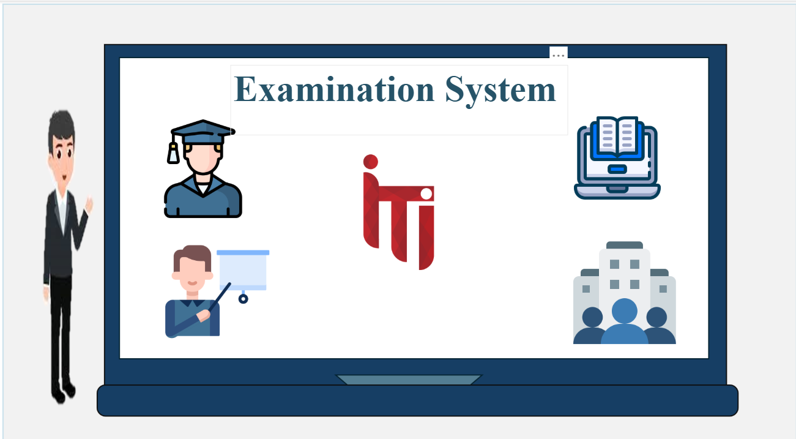
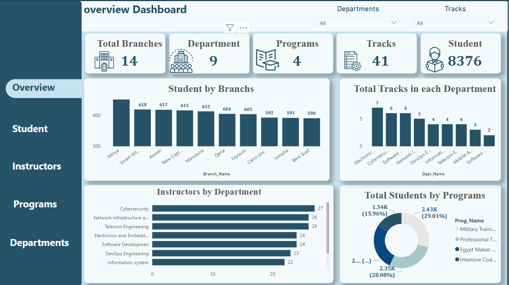
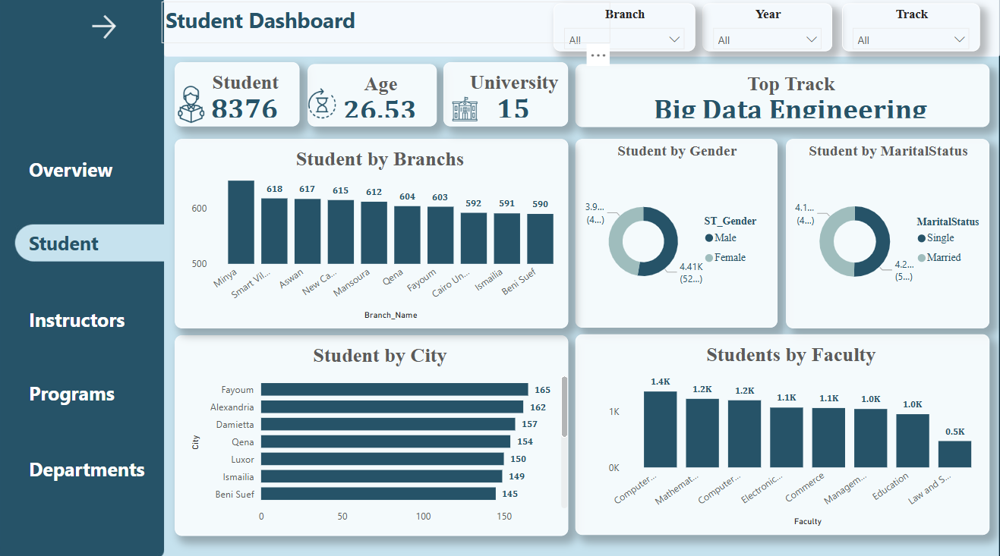
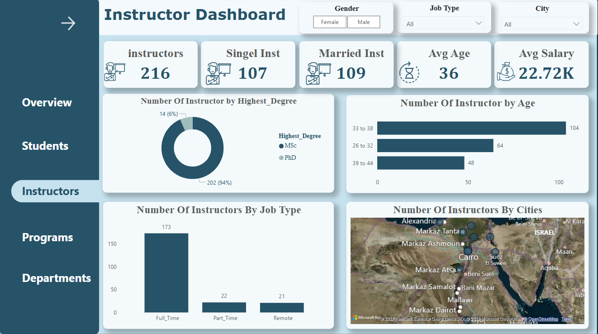
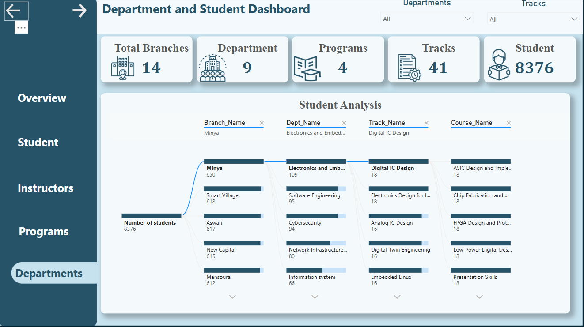
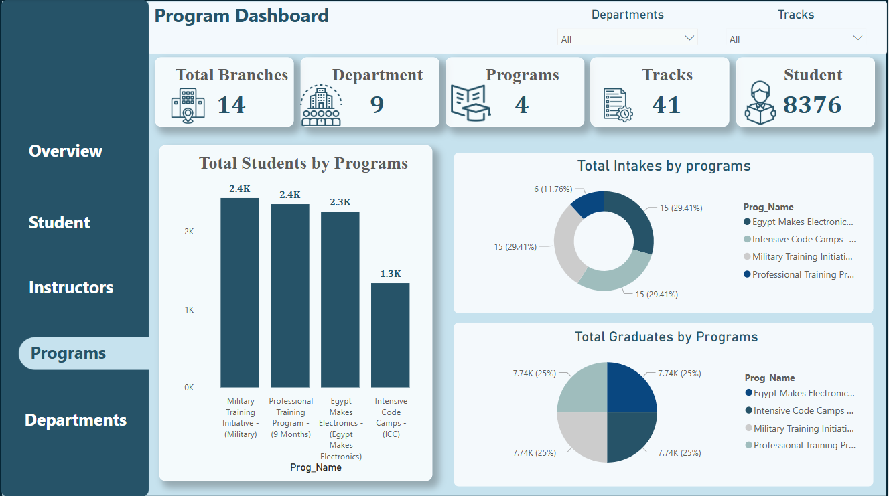

# Examination_System_ITI_Graduation_Project-
# 🎓 Examination System

A comprehensive platform developed as a graduation project to manage digital exams — from data modeling and reporting to a fully functional web application using **Streamlit**.

---

## 🧠 Project Overview

The **Examination System** streamlines managing students, instructors, courses, and exams. It spans the full life cycle of digital exam management, from backend database operations to user-facing analytics and exam-taking interfaces.

### 🔍 Core Components

- 🎓 **Student, Instructor, Course & Exam Management** via SQL Server
- 🔄 **CRUD operations** using stored procedures
- 🧾 **SSRS reports** for printable summaries
- 📊 **20 Power BI Dashboards** for analytics & insights
- 🌐 **Streamlit Web App** with role-based access
- 🧪 Dataset with **8,000+ records** to simulate a real-world environment

---

## 🚀 Features

### 🗄️ Relational Database

- Normalized schema ensuring efficiency and scalability
- Stored procedures for **Insert, Update, Delete** operations

### 📊 Data Visualization

- 📈 **Power BI Dashboards**  
  - KPIs on student performance, instructor activity, course statistics
- 🧾 **SSRS Reports**  
  - Printable insights for academic and administrative use

### 🌐 Streamlit Web Interface

| 👨‍🏫 Instructors Can | 👩‍🎓 Students Can |
|----------------------|-------------------|
| Log in via ID        | Log in via ID     |
| Create exams (`[GenerateExam]`) | Take assigned exams |
| View analytics       | Submit answers (`[StudentAnswers]`) |
|                      | View real-time results (`[CorrectExam]`) |

- ✅ Clean, intuitive UI (matching design spec)
- 🔐 Role-based access for security and personalization

### 🧠 Exam Correction Logic

- ⚙️ Auto-correction using stored procedures
- ⏱️ Real-time feedback and grading

---

## 🛠️ Technologies Used

| Category       | Technology            |
|----------------|------------------------|
| Database       | Microsoft SQL Server   |
| Reporting      | SSRS                   |
| Dashboards     | Power BI               |
| Web Framework  | Streamlit (Python)     |

---

## 📸 Screenshots
### 📊 Power BI Home 

### 📊 Power BI Overview

### 🎓 Student Dashboard 

### 👨‍🏫  Instructor Dashboard

### 📊 Department Dashboard 

### 🧾 Programs Dashboard 

## 🎥 Demo

Watch a full demo of the Examination System here:

